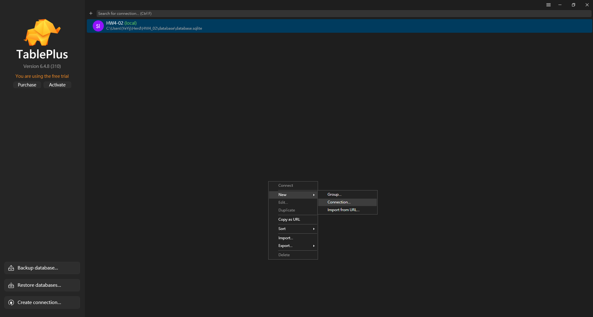
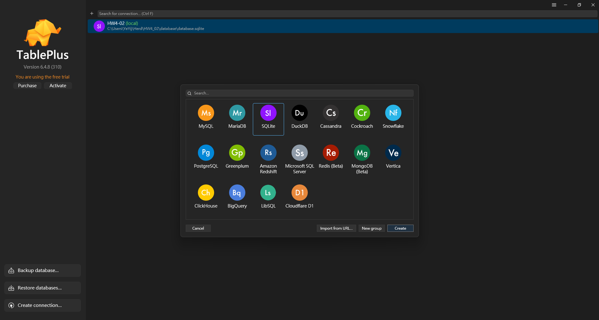
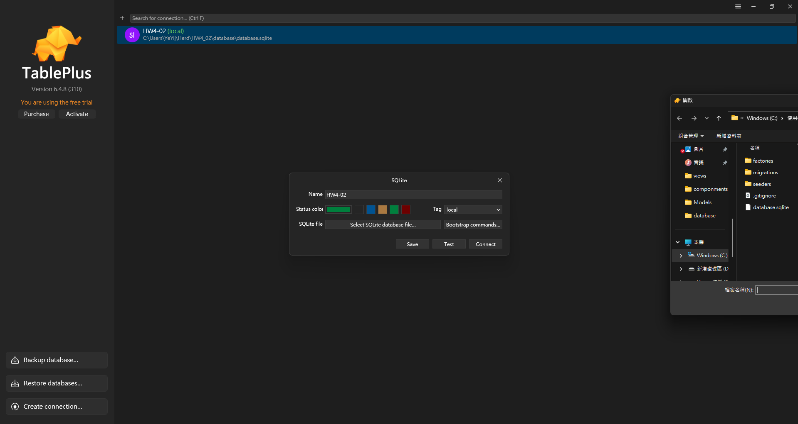

## 專案分工
| 成員 | 分工 | 網站連結 | 部屬完成 |
|--------|--------|--------|--------|
| 魏仁祥  | 登入<br>註冊  | [sd05](https://sd05.yeahlowflicker.directory/) | ✅ |
| 謝曉琪  | 總版面filter  | [sd07](https://sd07.yeahlowflicker.directory/) | ✅ |
| 葉羿君  | 貼文CRUD<br>留言CRUD  | [sd04](https://sd04.yeahlowflicker.directory/) | ✅ |
| 李宥寬  | 遠端部屬總教頭 | [sd06](https://sd06.yeahlowflicker.directory/) | ✅ |

## 環境安裝
我這邊是安裝laravel herd(內涵composer)
```bash
# clone GitHub 專案
git clone https://github.com/frank931023/HW4_02.git
cd HW4_02

# 安裝 Laravel 所需套件（用 Composer）
composer install
# 複製 .env.example 並建立 .env
cp .env.example .env
# 生成 Laravel 專案金鑰
php artisan key:generate

# 執行資料庫 migration（建表）
# 還未建過資料
php artisan migrate --seed
# 如果已經建立過資料
php artisan migrate:fresh --seed

# 引入bootstrap
npm install
npm run build

# 開啟專案(我是用 herd open)
herd open
# 如果沒有herd或著可以用以下試試，這laravel內建的，但我還在看看為什麼我用這個不行 >> 使用以下這指令需要將使用php版本中的php.ini的variables_order = "EGPCS" 改為 variables_order = "GPCS"
php artisan serve
```

## SQLite
1.安裝查看table的程式 [TablePlus](https://tableplus.com/)
- 開啟TablePlus
- 新增資料庫連結(介面空白區按右鍵，選擇"new"，再選擇"connection")

- 選擇SQLite後按"create"

- 填寫name
- 選擇專案下HW4_02/database/database.sqlite作為資料庫路徑(選擇後會顯示絕對路徑)

- 完成後按下"save"或"connect"皆可!

2.新增Table
```bash
# 如果沒有新增過資料
php artisan migrate
# 如果有新增過資料
php artisan migrate:fresh
```
3.新增假資料
```bash
# 進入交互式環境REPL
php artisan tinker
# 生成假資料
# Member 使用者會員
App\Models\Member::factory(10)->create()
# Page 討論版
App\Models\Page::factory(10)->create()
# Post 討論區
App\Models\Post::factory(10)->create()
# Comment 留言
App\Models\Comment::factory(10)->create()
```

# Deployment
```bash
/bin/bash -c "$(curl -fsSL https://php.new/install/linux/8.4)"
apt install php8.3-xml php8.3-sqlite3 composer npm -y
composer global require laravel/installer
sudo apt purge apache2

cd /var/www
git clone https://github.com/frank931023/HW4_02
cd HW4_02

composer update && composer install
cp .env.example .env
php artisan migrate --seed
php artisan key:generate
npm run build
sudo chmod -R a=rwx /var/www/HW4_02
# Development server
sudo php artisan serve --port 80 --host 0.0.0.0

```

## Example nginx configuration
```
server {
    server_name sd06.yeahlowflicker.directory;
    root /var/www/HW4_02/public;

    add_header X-Frame-Options "SAMEORIGIN";
    add_header X-Content-Type-Options "nosniff";

    index index.php;

    charset utf-8;

    location / {
        try_files $uri $uri/ /index.php?$query_string;
    }

    location = /favicon.ico { access_log off; log_not_found off; }
    location = /robots.txt  { access_log off; log_not_found off; }

    error_page 404 /index.php;

    location ~ ^/index\.php(/|$) {
        fastcgi_pass unix:/var/run/php/php8.3-fpm.sock;
        fastcgi_param SCRIPT_FILENAME $realpath_root$fastcgi_script_name;
        include fastcgi_params;
        fastcgi_hide_header X-Powered-By;
    }

    location ~ /\.(?!well-known).* {
        deny all;
    }

}
```

### With SSL

Enable the configuration above then use certbot to get let's encrypt ssl certificate
```bash
sudo snap install cerbot --classic
certbot --nginx
# Follow the instruction to generate ssl certificate
```

(Optional) Edit the updated configuration to serve it via direct ip connection as well

```server {
    server_name sd06.yeahlowflicker.directory;
    root /var/www/HW4_02/public;
    add_header X-Frame-Options "SAMEORIGIN";
    add_header X-Content-Type-Options "nosniff";

    index index.php;

    charset utf-8;

    location / {
        try_files $uri $uri/ /index.php?$query_string;
    }

    location = /favicon.ico { access_log off; log_not_found off; }
    location = /robots.txt  { access_log off; log_not_found off; }

    error_page 404 /index.php;

    location ~ ^/index\.php(/|$) {
        fastcgi_pass unix:/var/run/php/php8.3-fpm.sock;
        fastcgi_param SCRIPT_FILENAME $realpath_root$fastcgi_script_name;
        include fastcgi_params;
        fastcgi_hide_header X-Powered-By;
    }

    location ~ /\.(?!well-known).* {
        deny all;
    }

    listen [::]:443 ssl ipv6only=on; # managed by Certbot
    listen 443 ssl; # managed by Certbot
    ssl_certificate /etc/letsencrypt/live/sd06.yeahlowflicker.directory/fullchain.pem; # managed by Certbot
    ssl_certificate_key /etc/letsencrypt/live/sd06.yeahlowflicker.directory/privkey.pem; # managed by Certbot
    include /etc/letsencrypt/options-ssl-nginx.conf; # managed by Certbot
    ssl_dhparam /etc/letsencrypt/ssl-dhparams.pem; # managed by Certbot

}
server {
    if ($host = sd06.yeahlowflicker.directory) {
        return 301 https://$host$request_uri;
    } # managed by Certbot


    listen 80;
    listen [::]:80;
    server_name sd06.yeahlowflicker.directory 140.115.197.241;
    root /var/www/HW4_02/public;
    add_header X-Frame-Options "SAMEORIGIN";

    add_header X-Content-Type-Options "nosniff";


    index index.php;


    charset utf-8;


    location / {

        try_files $uri $uri/ /index.php?$query_string;

    }


    location = /favicon.ico { access_log off; log_not_found off; }

    location = /robots.txt  { access_log off; log_not_found off; }


    error_page 404 /index.php;


    location ~ ^/index\.php(/|$) {

        fastcgi_pass unix:/var/run/php/php8.3-fpm.sock;

        fastcgi_param SCRIPT_FILENAME $realpath_root$fastcgi_script_name;

        include fastcgi_params;

        fastcgi_hide_header X-Powered-By;

    }


    location ~ /\.(?!well-known).* {

        deny all;

    }
    # return 404; # managed by Certbot


}
```
